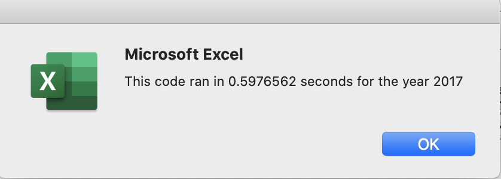

# stock-analysis-

## Overview of Project
The overview of this project is to be able to help Steve, a guy working in finance, help his parents find which stocks are worth investing their money in. To do this, we can evaluate and analyse data from 2017 and 2018 to see which each stock's daily total volume, and which stocks give high and low returns. Steve believes that a stock that is trading at high volume is a sustainable move. In addition, stocks that have high returns is also a good investment. 

## Results
### Evaluation 
After evaulating the data, I found out that the stock returns for 2017 in general were much higher than the stock returns for 2018. However, the total daily volume seems to be higher in 2018. In terms of the results for run time, I found that the refactored code ran faster by a very smidge amount of time in comparison to the non refactored code. Both scripts in the end took a very short amount of time to run, because there is only a limited amount of data. I think we would definitely see more of a difference if we had a much larger dataset evaulating a much larger amount of stocks. 

### Images for Run Time 
Original Script for 2017:

Original Script for 2018:

Refactored Script for 2017:

Refactored Script for 2018:

## Summary
### Advantage and Disadvantage of Refactoring Code
Some of the advantages of refactoring code is that you are able to reduce the complexity and simplify the design of the code and decrease the run time while preserving the functionality of the code. The execution time in the end can also be improved. You can also originally have multiple subs but then be able to place into one, making the entire code look more clean and organised. 
Some of the disadvantages of refactoring code is that it can make it easy for new bugs to be created. Also, sometimes refactoring can take a long time and is not necessary when we have good code. 

### Applying to Our Code 
These advantages are applied to the original VBA and refactored script because in our orginal code, we had two subroutines one for formatting and one for calculating daily total volume and returns. The new refactored code has the code about formatting at the end of the entire subroutine, which is preferable because it is cleaner to just have everything in one subroutine. In the end, our original code would be would be good for executing data analysis for a dozen stocks, but not for evaluating the entire stock market because that would take a long time for the initial code to run!
